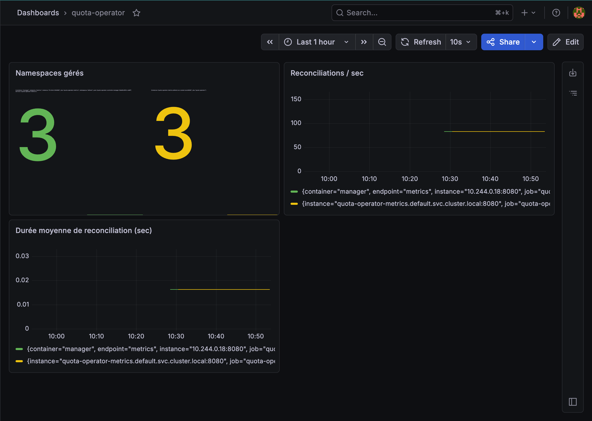

# quota-operator

[](https://github.com/MaloLelandais/quota-operator/actions/workflows/test-e2e.yml)

A Kubernetes operator that automatically manages `ResourceQuota` objects on namespaces based on annotations.

## How it works

Annotate any namespace with `quota-operator/tier` and the operator will automatically create and maintain the appropriate `ResourceQuota`:

```bash
kubectl annotate namespace my-namespace quota-operator/tier=small
```

The operator reconciles continuously — if you change the tier annotation, the quota is updated automatically.

## Tiers

| Tier   | CPU | Memory | Max Pods |
|--------|-----|--------|----------|
| small  | 1   | 2Gi    | 10       |
| medium | 4   | 8Gi    | 30       |
| large  | 8   | 16Gi   | 100      |

Tiers are fully configurable via the `NamespaceQuotaPolicy` CRD.

## Installation

```bash
helm install quota-operator helm/quota-operator
```

## Custom tiers

```yaml
apiVersion: quota.malolelandais.dev/v1alpha1
kind: NamespaceQuotaPolicy
metadata:
  name: default-policy
spec:
  tierAnnotation: "quota-operator/tier"
  tiers:
    small:
      cpu: "1"
      memory: "2Gi"
      maxPods: 10
    xlarge:
      cpu: "16"
      memory: "32Gi"
      maxPods: 200
```

## Development

**Prerequisites:** Go 1.21+, Docker, kind, kubebuilder

```bash
# Create local cluster
kind create cluster --name quota-operator

# Install CRDs
make install

# Run operator locally
make run

# In another terminal — apply a policy and test
kubectl apply -f config/samples/quota_v1alpha1_namespacequotapolicy.yaml
kubectl create namespace test-small
kubectl annotate namespace test-small quota-operator/tier=small
kubectl get resourcequota -n test-small
```

## Architecture

```
┌─────────────────────────────────────────────┐
│              Kubernetes API Server           │
└──────────┬──────────────────────┬───────────┘
           │ watch Namespaces      │ watch NamespaceQuotaPolicy
           ▼                      ▼
┌─────────────────────────────────────────────┐
│           quota-operator (controller)        │
│                                             │
│  1. Namespace annotated → trigger reconcile │
│  2. Fetch NamespaceQuotaPolicy              │
│  3. Find matching tier config               │
│  4. Create / Update ResourceQuota           │
└─────────────────────────────────────────────┘
```

## Observability

The operator exposes Prometheus metrics on `:8080/metrics` and includes a Grafana dashboard.

### Metrics

| Metric | Type | Description |
|--------|------|-------------|
| `quota_operator_managed_namespaces` | Gauge | Number of namespaces currently managed by a policy |
| `quota_operator_reconciliations_total` | Counter | Total reconciliations, labeled by `policy` and `status` (`success`\|`error`) |
| `quota_operator_reconciliation_duration_seconds` | Histogram | Reconciliation duration in seconds |

### Setup (kube-prometheus-stack)

```bash
helm repo add prometheus-community https://prometheus-community.github.io/helm-charts
helm install monitoring prometheus-community/kube-prometheus-stack \
  --namespace monitoring --create-namespace \
  --set grafana.adminPassword=admin \
  --set prometheus.prometheusSpec.serviceMonitorSelectorNilUsesHelmValues=false
kubectl apply -f config/prometheus/monitor.yaml
```

### Dashboard



## Built with

- [controller-runtime](https://github.com/kubernetes-sigs/controller-runtime)
- [kubebuilder](https://github.com/kubernetes-sigs/kubebuilder)
